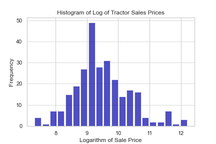

# Nonparametric Methods

This demo, in the corresponding script ```python_nonparametrics.py``` 
gives examples of "regression" models
by considering a number of different model specifications. 
A *model specification* is a precise statement of the equation to be estimated. In this example, many of the model specification choices
  have a nonparametric form and are compared to parametric models.
A *parametric* model is the form that you would find familiar from
  QMB 3200 or a linear regression course: 
  it is an equation with *parameters* (i.e. slope coefficients) to estimate.
A *nonparametric* model specifies the algorithm that performs the model-fitting
  but the form of the equation can be an arbitrary curve in a family of
  functions. 
  Several machine learning models have this property. 
In this demo, we use a sample dataset tractor_sales.csv 
with the following variables:
-  saleprice is the sale price of a tractor in dollars
-  horsepower is the horsepower rating of the engine
-  age is the age of the tractor in years
-  enghours is the number of hours the engine has been run
-  diesel is an indicator that the engine runs on diesel fuel
-  fwd indicates that the tractor has four-wheel-drive
-  manual indicates that the tractor has a manual transmission
-  johndeere indicates that the brand of the tractor is John Deere
-  cab indicates that the tractor has an enclosed cab
-  spring indicates that the tractor was sold in the spring
-  summer indicates that the tractor was sold in the summer
-  winter indicates that the tractor was sold in the winter

We will use the following Python modules:

- os to set the working directory
- numpy for the logistic transformation
- pandas to read and inspect data
- statsmodels.formula.api to estimate linear regression
- statsmodels.nonparametric.kernel_regression for nonparametric kernel regression
- matplotlib.pyplot to plot regression results


We begin by loading the dataset

```python
tractors = pd.read_csv('tractor_sales.csv')
```

Inspect the data before modeling. 
The dataset has three numeric variables
```python
tractors[['saleprice','horsepower','age','enghours']].describe()
           saleprice  horsepower         age      enghours
count     276.000000  276.000000  276.000000    276.000000
mean    20746.557971  101.061594   15.905797   3530.224638
std     27522.114033   84.611711    9.679134   3408.494043
min      1500.000000   16.000000    2.000000      1.000000
25%      7750.000000   47.750000    7.000000    777.250000
50%     12000.000000   80.000000   15.000000   2398.000000
75%     20925.000000  108.500000   24.000000   5409.750000
max    200000.000000  535.000000   33.000000  18744.000000
```

The dataset also includes several binary variables.
```python
tractors[['manual','johndeere','cab',
          'spring', 'summer', 'winter']].describe()
           manual   johndeere         cab      spring      summer     winter
count  276.000000  276.000000  276.000000  276.000000  276.000000  276.00000
mean     0.702899    0.141304    0.543478    0.224638    0.231884    0.17029
std      0.457812    0.348968    0.499011    0.418102    0.422802    0.37657
min      0.000000    0.000000    0.000000    0.000000    0.000000    0.00000
25%      0.000000    0.000000    0.000000    0.000000    0.000000    0.00000
50%      1.000000    0.000000    1.000000    0.000000    0.000000    0.00000
75%      1.000000    0.000000    1.000000    0.000000    0.000000    0.00000
max      1.000000    1.000000    1.000000    1.000000    1.000000    1.00000
```

We will use these variables to predict the price of used tractors. 


## Visualizing the dependent variable

### Histograms


First, plot a histogram with the default width of bins.

```python
n, bins, patches = plt.hist(x = tractors['saleprice'], 
                            bins = 'auto', 
                            color = '#0504aa',
                            alpha = 0.7, rwidth = 0.85)
plt.grid(axis='y', alpha=0.75)
plt.xlabel('Sale Price')
plt.ylabel('Frequency')
plt.title('Histogram of Tractor Sales Prices')
plt.show()
```


You might not know it but you have just conducted
nonparametric estimation.

Now, let's see if we can fine-tune this picture.


We can choose the number of bins to determine
the smoothness of the distribution.

```python
n, bins, patches = plt.hist(x = tractors['saleprice'], 
                            bins = 10, 
                            color = '#0504aa',
                            alpha = 0.7, rwidth = 0.85)
plt.grid(axis='y', alpha=0.75)
plt.xlabel('Sale Price')
plt.ylabel('Frequency')
plt.title('Histogram of Tractor Sales Prices')
plt.show()
```


With 10 bins it appears to have a smoothly declining density.


Try it again with many bins.

```python
n, bins, patches = plt.hist(x = tractors['saleprice'], 
                            bins = 100, 
                            color = '#0504aa',
                            alpha = 0.7, rwidth = 0.85)
plt.grid(axis='y', alpha=0.75)
plt.xlabel('Sale Price')
plt.ylabel('Frequency')
plt.title('Histogram of Tractor Sales Prices')
plt.show()
```


Now it looks very choppy with too many
gaps between the populated bins.
The picture is too jagged.

At this point, you should appreciate the default values,
although sometimes you will want to do some fine-tuning
to investigate the data.


### Kernel density somoothing

Another way to visualize the density is by
*kernel density smoothing*, which is so called
not because *we* intend to plot a density
but because *the method* uses a density to
calculate the plot.

It takes a weighted average, using a density
called a *kernel* at each point on the plot.

```python
dist = tractors['saleprice']

fig, ax = plt.subplots()
dist.plot.kde(ax = ax, legend = False, 
              title = 'Density of Tractor Sales Prices')
dist.plot.hist(density = True, ax = ax)
ax.set_ylabel('Probability')
ax.grid(axis = 'y')
ax.set_facecolor('#d8dcd6')
```


The kernel-smoothed density is essentially a
weighted average of the neighboring points, taken at
each value along the horizontal axis.


Similar to histograms, you can adjust the *bandwidth*
parameter to adjust the smoothness of the density.
The bandwidth determines the weights in the weighted average ad these weights depend on the distance from each value
of the variable.


With a large bandwidth you get a smoother density.

```python
fig, ax = plt.subplots()
dist.plot.kde(ax = ax, legend = False, 
              title = 'Density of Tractor Sales Prices', 
              bw_method = 1)
dist.plot.hist(density = True, ax = ax)
ax.set_ylabel('Probability')
ax.grid(axis = 'y')
ax.set_facecolor('#d8dcd6')
```


Notice, however, that the density bleeds into negative territory,
which is not posible with sales.
(This doesn't make sense: no one pays for you to take their tractor.)

This density does not look very much like the histogram.

Try it again with a smaller bandwidth.

```python
fig, ax = plt.subplots()
dist.plot.kde(ax = ax, legend = False, 
              title = 'Density of Tractor Sales Prices', 
              bw_method = 0.1)
dist.plot.hist(density = True, ax = ax)
ax.set_ylabel('Probability')
ax.grid(axis = 'y')
ax.set_facecolor('#d8dcd6')
```


This is better but now the density is very jagged.
There are peaks on the prices that happened to occur
and valleys on the prices where sales did not occur.


## Logarithmic transformation

When regression modelling, the model fit is often more
accurate when the variable is nearly normally distributed.

Let's consider the log tractor price as the dependent variable.

```python
tractors['log_saleprice'] = np.log(tractors['saleprice'])
```
Now let's plot a histogram of the log sales prices.

With some trial-and-error, I chose 20 bins.
```python
n, bins, patches = plt.hist(x = tractors['log_saleprice'], 
                            bins = 20, 
                            color = '#0504aa',
                            alpha = 0.7, rwidth = 0.85)
plt.grid(axis='y', alpha=0.75)
plt.xlabel('Sale Price')
plt.ylabel('Frequency')
plt.title('Histogram of Log of Tractor Sales Prices')
plt.show()
```



This histogram looks almost symmetric.
It is much close to the normal distribution.

Now let's plot a density.

```python
dist_log = tractors['log_saleprice']

fig, ax = plt.subplots()
dist_log.plot.kde(ax = ax, legend = False, 
              title = 'Density of Log of Tractor Sales Prices', 
              bw_method = 0.5)
dist_log.plot.hist(density = True, ax = ax)
ax.set_ylabel('Probability')
ax.grid(axis = 'y')
ax.set_facecolor('#d8dcd6')
```


This looks very smooth but also plausible.
We should build a model to predict the
log of the tractor prices.

Note that when we do this, the coefficients no longer
have the same interpretation:
with this specification, the change in the explanatory
variables (the characteristics of the tractors)
indicates a proportional change in the
dependent variable (the prices of the tractors).


## Linear Regression.

In an econometrics course, you might fit a
linear regression model such as this one.

### Fit a Linear Regression Model (with ```statsmodels``` module).

This is a module designed in the format that would
commonly be used by statisticians (and in econometrics class).


Just to compare, we'll run the linear model first:

```python
# Initialize and specify the linear model.
sm_fmla = "saleprice ~ \
    horsepower + \
    age + enghours + \
    diesel + fwd + manual + johndeere + cab + \
    spring + summer + winter"
reg_model_sm = sm.ols(formula = sm_fmla, 
                      data = tractors)

# Fit the model.
reg_model_fit_sm = reg_model_sm.fit()
```

Display the summary table of regression results.
```python
>>> print(reg_model_fit_sm.summary())
                            OLS Regression Results                            
==============================================================================
Dep. Variable:              saleprice   R-squared:                       0.660
Model:                            OLS   Adj. R-squared:                  0.646
Method:                 Least Squares   F-statistic:                     46.57
Date:                Mon, 04 Apr 2022   Prob (F-statistic):           1.69e-55
Time:                        15:56:24   Log-Likelihood:                -3063.8
No. Observations:                 276   AIC:                             6152.
Df Residuals:                     264   BIC:                             6195.
Df Model:                          11                                         
Covariance Type:            nonrobust                                         
==============================================================================
                 coef    std err          t      P>|t|      [0.025      0.975]
------------------------------------------------------------------------------
Intercept   1.302e+04   4468.259      2.913      0.004    4217.829    2.18e+04
horsepower   226.5840     15.167     14.939      0.000     196.720     256.448
age         -699.7279    146.846     -4.765      0.000    -988.867    -410.589
enghours      -1.9344      0.393     -4.917      0.000      -2.709      -1.160
diesel       444.3901   4000.650      0.111      0.912   -7432.852    8321.632
fwd         1491.0701   2413.937      0.618      0.537   -3261.950    6244.090
manual     -4214.1008   2550.808     -1.652      0.100   -9236.617     808.415
johndeere   1.371e+04   2972.686      4.612      0.000    7856.685    1.96e+04
cab         8072.0643   2597.638      3.107      0.002    2957.341    1.32e+04
spring     -1815.2076   2672.904     -0.679      0.498   -7078.130    3447.715
summer     -4923.8739   2620.855     -1.879      0.061   -1.01e+04     236.565
winter     -1579.6222   2933.804     -0.538      0.591   -7356.254    4197.010
==============================================================================
Omnibus:                      125.227   Durbin-Watson:                   0.947
Prob(Omnibus):                  0.000   Jarque-Bera (JB):             1013.284
Skew:                           1.628   Prob(JB):                    9.29e-221
Kurtosis:                      11.804   Cond. No.                     2.83e+04
==============================================================================

Notes:
[1] Standard Errors assume that the covariance matrix of the errors is correctly specified.
[2] The condition number is large, 2.83e+04. This might indicate that there are
strong multicollinearity or other numerical problems.
```

Compare this to the log-linear model.


Initialize and specify the log-linear model.

```python
sm_fmla = "log_saleprice ~ \
    horsepower + \
    age + enghours + \
    diesel + fwd + manual + johndeere + cab + \
    spring + summer + winter"

reg_model_sm = sm.ols(formula = sm_fmla, 
                      data = tractors)
```

Fit the model.
```python
reg_model_fit_sm = reg_model_sm.fit()
```

Display a summary table of regression results.
```python
>>> print(reg_model_fit_sm.summary())
                            OLS Regression Results                            
==============================================================================
Dep. Variable:          log_saleprice   R-squared:                       0.779
Model:                            OLS   Adj. R-squared:                  0.770
Method:                 Least Squares   F-statistic:                     84.70
Date:                Mon, 04 Apr 2022   Prob (F-statistic):           6.11e-80
Time:                        15:57:37   Log-Likelihood:                -150.12
No. Observations:                 276   AIC:                             324.2
Df Residuals:                     264   BIC:                             367.7
Df Model:                          11                                         
Covariance Type:            nonrobust                                         
==============================================================================
                 coef    std err          t      P>|t|      [0.025      0.975]
------------------------------------------------------------------------------
Intercept      8.8812      0.116     76.390      0.000       8.652       9.110
horsepower     0.0049      0.000     12.397      0.000       0.004       0.006
age           -0.0296      0.004     -7.753      0.000      -0.037      -0.022
enghours   -3.584e-05   1.02e-05     -3.502      0.001    -5.6e-05   -1.57e-05
diesel         0.3094      0.104      2.972      0.003       0.104       0.514
fwd            0.2672      0.063      4.253      0.000       0.143       0.391
manual        -0.1632      0.066     -2.459      0.015      -0.294      -0.033
johndeere      0.2983      0.077      3.856      0.000       0.146       0.451
cab            0.6697      0.068      9.909      0.000       0.537       0.803
spring        -0.0399      0.070     -0.574      0.566      -0.177       0.097
summer        -0.0652      0.068     -0.956      0.340      -0.199       0.069
winter         0.0370      0.076      0.484      0.629      -0.113       0.187
==============================================================================
Omnibus:                       16.973   Durbin-Watson:                   1.470
Prob(Omnibus):                  0.000   Jarque-Bera (JB):               18.765
Skew:                          -0.559   Prob(JB):                     8.42e-05
Kurtosis:                       3.619   Cond. No.                     2.83e+04
==============================================================================

Notes:
[1] Standard Errors assume that the covariance matrix of the errors is correctly specified.
[2] The condition number is large, 2.83e+04. This might indicate that there are
strong multicollinearity or other numerical problems.
```

You can see statistically significant relationships
with these variables.
Notice the positive relationship between prices
and horsepower.
We will investigate this relationship further.


### A nonlinear parametric model

Consider a polynomial functional form for horsepower.
The idea is that horsepower improves performance up to a limit,
then extra power does not add value; it only consumes more fuel,
so buyers don't want to pay as much for tractors with
higher fuel costs.

Create a variable ```squared_horsepower```
to investigate quadratic relationship of sale price to horsepower.
```python
tractors['squared_horsepower'] = tractors['horsepower']**2
```

Now fit a regression model with this extra variable.
```python
sm_fmla = "log_saleprice ~ \
    horsepower + squared_horsepower + \
    age + enghours + \
    diesel + fwd + manual + johndeere + cab + \
    spring + summer + winter"

reg_model_sm = sm.ols(formula = sm_fmla, 
                      data = tractors)
```

Fit the model and display a summary table of regression results.
```python
reg_model_fit_sm = reg_model_sm.fit()

print(reg_model_fit_sm.summary())
```

The summary of this model is as follows.

```python
                            OLS Regression Results                            
==============================================================================
Dep. Variable:          log_saleprice   R-squared:                       0.808
Model:                            OLS   Adj. R-squared:                  0.799
Method:                 Least Squares   F-statistic:                     92.00
Date:                Mon, 04 Apr 2022   Prob (F-statistic):           9.40e-87
Time:                        16:01:00   Log-Likelihood:                -131.12
No. Observations:                 276   AIC:                             288.2
Df Residuals:                     263   BIC:                             335.3
Df Model:                          12                                         
Covariance Type:            nonrobust                                         
======================================================================================
                         coef    std err          t      P>|t|      [0.025      0.975]
--------------------------------------------------------------------------------------
Intercept              8.7255      0.112     78.212      0.000       8.506       8.945
horsepower             0.0111      0.001     10.422      0.000       0.009       0.013
squared_horsepower -1.409e-05   2.26e-06     -6.231      0.000   -1.85e-05   -9.63e-06
age                   -0.0321      0.004     -8.919      0.000      -0.039      -0.025
enghours           -4.086e-05   9.61e-06     -4.253      0.000   -5.98e-05   -2.19e-05
diesel                 0.2145      0.099      2.177      0.030       0.021       0.409
fwd                    0.2753      0.059      4.685      0.000       0.160       0.391
manual                -0.1531      0.062     -2.465      0.014      -0.275      -0.031
johndeere              0.3097      0.072      4.280      0.000       0.167       0.452
cab                    0.4779      0.070      6.796      0.000       0.339       0.616
spring                -0.0489      0.065     -0.752      0.453      -0.177       0.079
summer                -0.0573      0.064     -0.898      0.370      -0.183       0.068
winter                 0.0460      0.071      0.644      0.520      -0.095       0.187
==============================================================================
Omnibus:                       44.504   Durbin-Watson:                   1.515
Prob(Omnibus):                  0.000   Jarque-Bera (JB):               75.508
Skew:                          -0.903   Prob(JB):                     4.01e-17
Kurtosis:                       4.818   Cond. No.                     2.28e+05
==============================================================================

Notes:
[1] Standard Errors assume that the covariance matrix of the errors is correctly specified.
[2] The condition number is large, 2.28e+05. This might indicate that there are
strong multicollinearity or other numerical problems.
```

## Nonparametric estimation


Now consider that the quadratic model may not be quite right.
Maybe some other nonlinear function would be more accurate.

A nonparametric approach can estimate the relationship
flexibly to determine what functional form should be used.

For kernel regression, we will pass the prices and horsepower
as separate arrays.

```python
y = tractors['log_saleprice']
X = tractors['horsepower']
```

Initialize the model object.
```python
kde_reg = npreg.KernelReg(endog = y, exog = X, var_type = 'c')
```

Fit the predictions to a grid of values.
```python
X_grid = np.arange(0, 500, 10)
kde_pred = kde_reg.fit(data_predict = X_grid)
```

Plot the fitted curve with a scattergraph of the data.
```python
fig, ax = plt.subplots()
ax.plot(tractors['horsepower'], tractors['log_saleprice'], 
        '.', alpha = 0.5)
ax.plot(X_grid, kde_pred[0], '-', color='tab:blue', alpha = 0.9)
plt.show()
```


### Tuning the bandwidth

In the above example, an algorithm determines
the size of the bandwidth.
You can also specify it as an array
the same length as the number of variables
(but we only used one variable: horsepower).


Initialize the model object.
```python
kde_reg = npreg.KernelReg(endog = y, exog = X, var_type = 'c', 
                          bw = np.array([10]))

# Fit the predictions to a grid of values. 
X_grid = np.arange(0, 500, 10)
kde_pred = kde_reg.fit(data_predict = X_grid)
```

Plot the fitted curve with a scattergraph of the data.
```python
fig, ax = plt.subplots()
ax.plot(tractors['horsepower'], tractors['log_saleprice'], 
        '.', alpha = 0.5)
ax.plot(X_grid, kde_pred[0], '-', color='tab:blue', alpha = 0.9)
plt.show()
```


You can see it is more variable and,
similarly, could be made smoother.


## Semiparametric estimation

Now, let's fit this curve in a linear regression model.

Initialize the model object, the 
fit the predictions to a grid of values. 

```python
kde_reg = npreg.KernelReg(endog = y, exog = X, var_type = 'c')

# X_grid = np.arange(0, 500, 10)
kde_pred = kde_reg.fit() 
```
Notice that this time, we did not pass a list of gridpoints
to produce a graph:
the default fits to the horsepower observations in the dataset, 
which we use to create a new variable.

Now, create the variable with this predicted curve.
```python
tractors['horsepower_np'] = kde_pred[0]
```

Then fit a regression model with this extra variable.
```python
sm_fmla = "log_saleprice ~ \
    horsepower_np + \
    age + enghours + \
    diesel + fwd + manual + johndeere + cab + \
    spring + summer + winter"

reg_model_sm = sm.ols(formula = sm_fmla, 
                      data = tractors)
```

Fit the model and display a summary table of regression results.
```python
reg_model_fit_sm = reg_model_sm.fit()

print(reg_model_fit_sm.summary())
```

This produces the following ouput.

```python
                            OLS Regression Results                            
==============================================================================
Dep. Variable:          log_saleprice   R-squared:                       0.820
Model:                            OLS   Adj. R-squared:                  0.812
Method:                 Least Squares   F-statistic:                     109.2
Date:                Mon, 04 Apr 2022   Prob (F-statistic):           1.74e-91
Time:                        16:04:53   Log-Likelihood:                -122.09
No. Observations:                 276   AIC:                             268.2
Df Residuals:                     264   BIC:                             311.6
Df Model:                          11                                         
Covariance Type:            nonrobust                                         
=================================================================================
                    coef    std err          t      P>|t|      [0.025      0.975]
---------------------------------------------------------------------------------
Intercept         1.8111      0.466      3.883      0.000       0.893       2.730
horsepower_np     0.8127      0.052     15.740      0.000       0.711       0.914
age              -0.0270      0.003     -7.778      0.000      -0.034      -0.020
enghours        -3.2e-05    9.1e-06     -3.516      0.001   -4.99e-05   -1.41e-05
diesel            0.2072      0.094      2.194      0.029       0.021       0.393
fwd               0.3177      0.056      5.631      0.000       0.207       0.429
manual           -0.1789      0.060     -2.981      0.003      -0.297      -0.061
johndeere         0.2442      0.070      3.483      0.001       0.106       0.382
cab               0.4479      0.066      6.753      0.000       0.317       0.579
spring           -0.0681      0.063     -1.082      0.280      -0.192       0.056
summer           -0.0501      0.062     -0.814      0.416      -0.171       0.071
winter            0.0935      0.069      1.361      0.175      -0.042       0.229
==============================================================================
Omnibus:                       46.570   Durbin-Watson:                   1.461
Prob(Omnibus):                  0.000   Jarque-Bera (JB):               91.764
Skew:                          -0.874   Prob(JB):                     1.19e-20
Kurtosis:                       5.218   Cond. No.                     9.96e+04
==============================================================================

Notes:
[1] Standard Errors assume that the covariance matrix of the errors is correctly specified.
[2] The condition number is large, 9.96e+04. This might indicate that there are
strong multicollinearity or other numerical problems.
```


The fit is an improvement but the quadratic form
for horsepower was already fairly good.
In business, you have to balance the added accuracy in prediction
against the added complexity of the estimation method. 
The tradeoff is in both computing time (both in and out of the computer)
but also in the risk of complications later on, 
in addition to the more lengthy explanation to the stakeholders.
This last point may seem insignificant to you now, 
but later you might find that it is difficult to book time
with a Vice President to make a decision on your findings. 


## Other Nonparametric Methods

How does this relate to the nnparametric methods described in
the textbook *Business Data Science* by Matt Taddy, among others?
The nonparametric techniques discussed in Chapter 9
use decision trees to fit an arbitrary function to the data.
This produces a step function, or piecewise constant function
to approximate the relationship between, say, 
sales price and horsepower. 

Although decision trees produce a cruder approximation to the relationship, 
the main advantage of this method is in efficiency and, 
as a result, scalability:
it can be applied to datasets with a large number of variables
to determine which variables should be included in the model. 
Once you have a manageable number of variables, 
you can use an approach like the one we took above 
to estimate a well-specified model, 
with the flexibility to account for the nonlinearity present in the data. 


